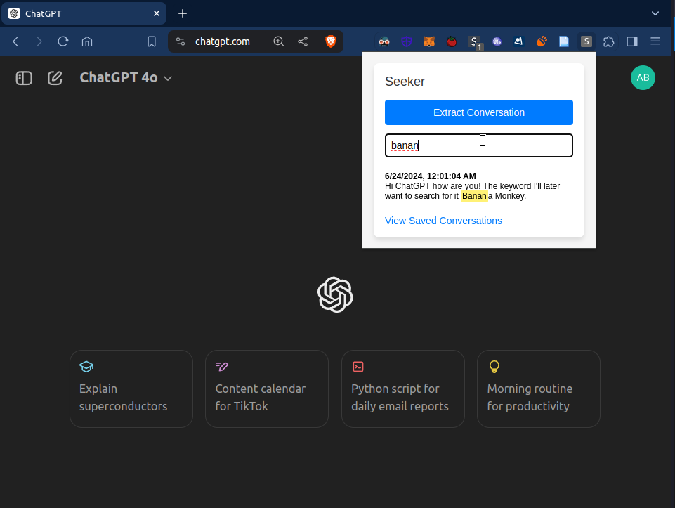

# Seeker - The missing search for ChatGPT

## Description

This Chrome extension allows you to easily search through your ChatGPT conversations. It saves your chats locally (only when you ask it to!) and provides a powerful search interface to find specific information from your past conversations.

## Demo

## Features

- Saves ChatGPT conversations only when you click 
"extract chat" button
- Stores conversations locally in your browser for privacy
- Provides a dedicated search page to find specific content in your chats
- Displays a list of all saved conversations with timestamps

## Installation

To install this extension from source:

1. Download or clone this repository to your local machine.

2. Open your Chromium-based browser (Chrome, Brave, Edge, etc.) and go to the extensions page:
   - Chrome:[ `chrome://extensions/`](chrome://extensions/)
   - Brave: [`brave://extensions/`(brave://extensions/)]
   - Edge:[ `edge://extensions/`](edge://extensions/)

3. Enable "Developer mode" using the toggle in the top right corner.

4. Click the "Load unpacked" button that appears.

5. Navigate to and select the folder containing the extension files.

6. The extension should now be installed and visible in your extensions list.

7. Pin it! Click the puzzle piece icon in your browser toolbar, find the extension, and click the pin icon to keep it visible.

## Usage

1. The extension automatically saves your ChatGPT conversations as you chat.

2. To search your chats:
   - Click the extension icon in your browser toolbar
   - Click the "Search Conversations" link in the popup

3. On the search page:
   - Type your search terms in the input box
   - Results will update in real-time, showing matching conversations
   - Each result displays the conversation URL, timestamp, and matching messages

4. Click on a result to see more context or to go to the full conversation.

## Privacy

All data is stored locally in your browser. Your conversations are not sent to any external servers.

## Permissions

This extension requires these permissions:
- `activeTab`: To access ChatGPT page content
- `storage`: To save conversations locally
- `scripting`: To run scripts on ChatGPT pages
- `tabs`: To detect active ChatGPT tabs

## Troubleshooting

If you're having issues:

1. Ensure you're on a ChatGPT page (https://chat.openai.com/ or https://chatgpt.com/).
2. Try refreshing the ChatGPT page.
3. Disable and re-enable the extension, or reinstall if problems persist.
4. Open the issue on this repository if you need further assistance.

### Why is this not on the Chrome Web Store?

Because I don't feel like it. You can publish it and take credit if you want to. I just wanted to make this for fun. Also, dealing with Google's KYC and developer account setup is a pain - and I say this after having an App Store account. Maybe I'll get around to it sometime later this week.